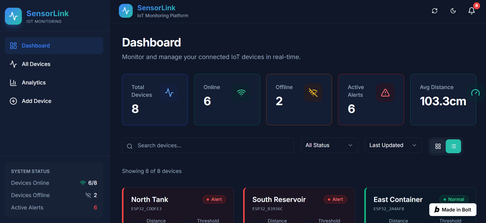
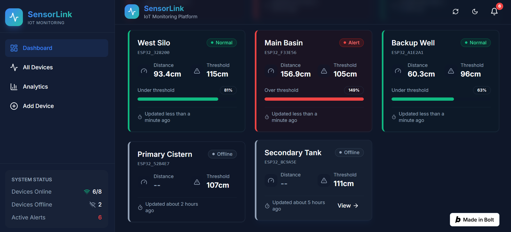
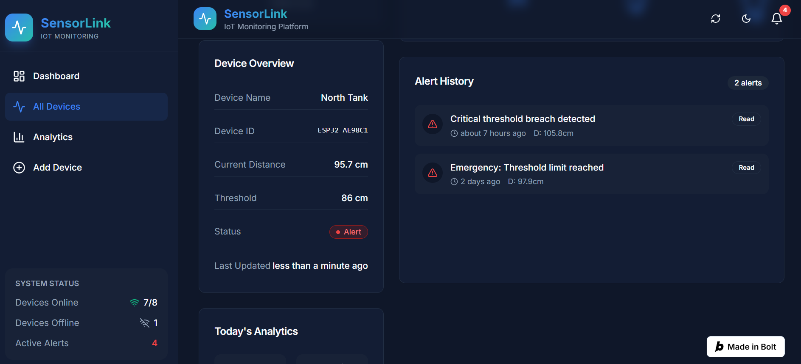
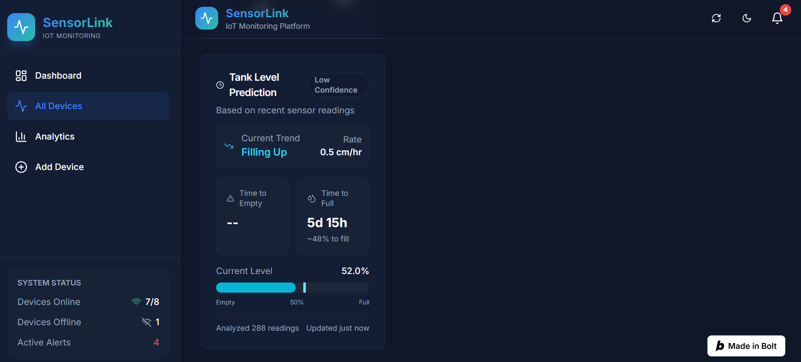
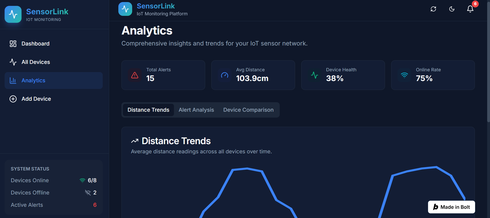
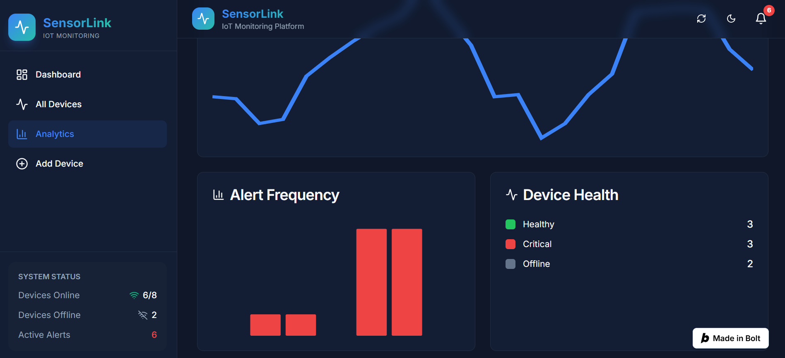
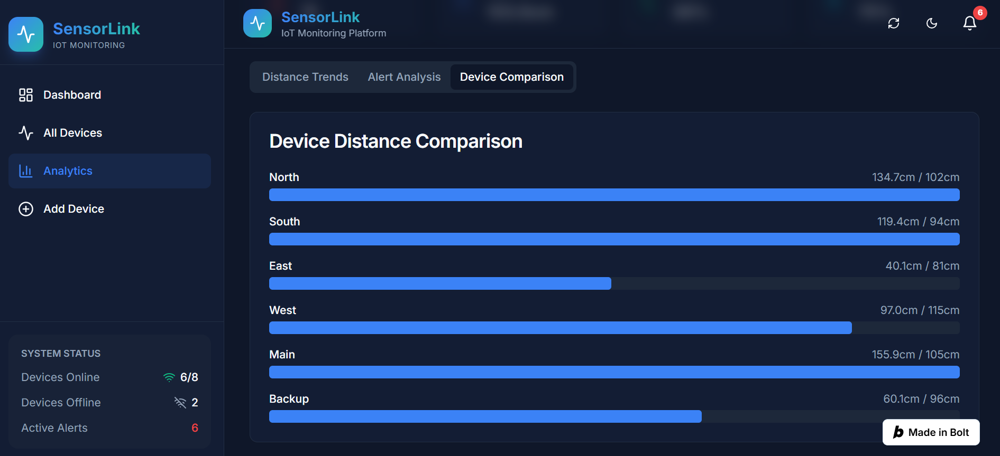
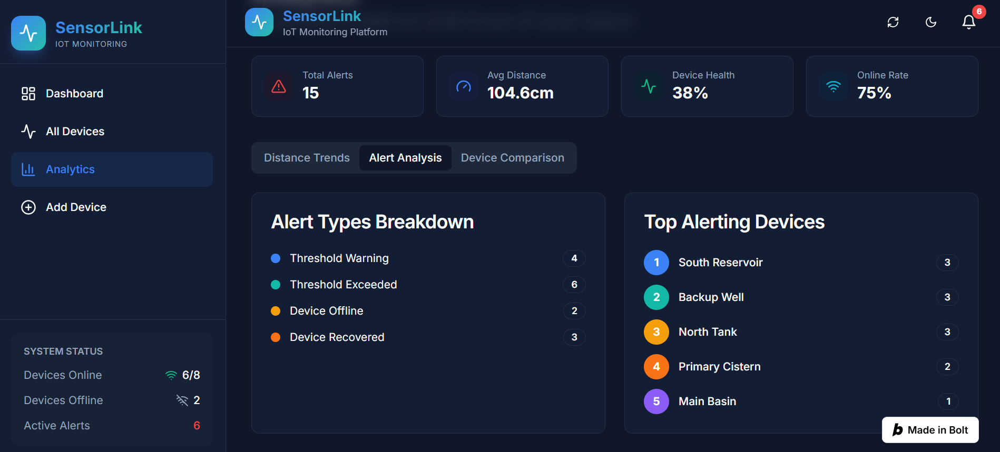
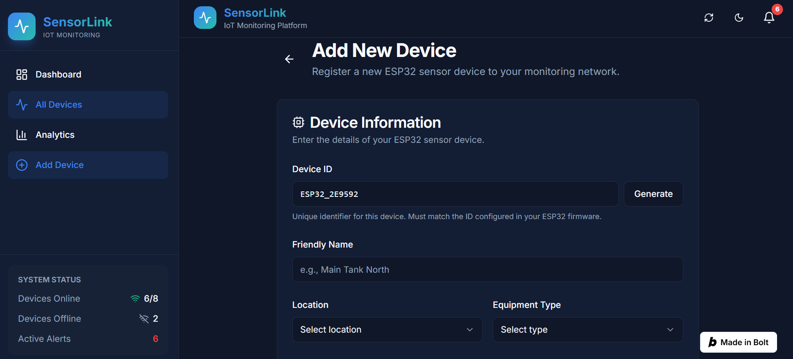
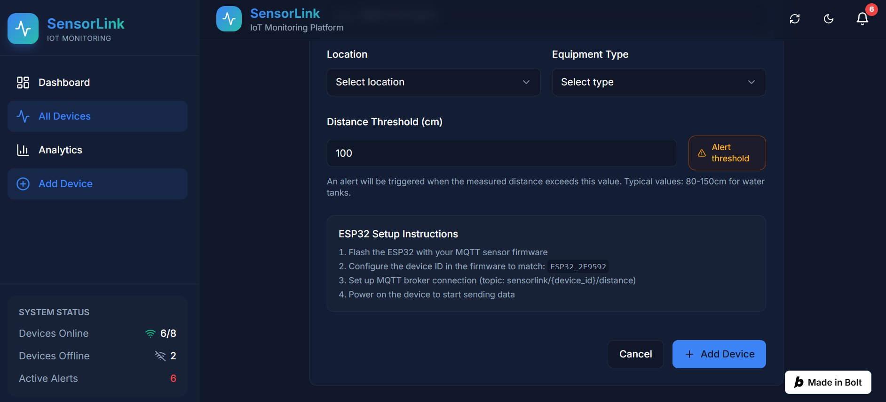

# SensorLink

<p align="center">
  <b>Real-Time IoT Monitoring & Predictive Analytics Platform</b><br>
  Monitor ESP32 devices, visualize sensor data, receive smart alerts, and predict resource levels through an intuitive dashboard.
</p>

---

## Overview

SensorLink is a modern IoT monitoring platform built using **Next.js**, **React**, and **TypeScript** that communicates with **ESP32-based sensor devices** over **MQTT**.

The platform enables users to:

- Monitor multiple IoT devices in real time
- Configure custom alert thresholds
- Visualize analytics and historical trends
- Compare device performance
- Receive intelligent alerts
- Predict the estimated time until a monitored container becomes full or empty

Designed for smart monitoring applications such as **water tanks, storage containers, reservoirs, and smart home automation**.

---

## Features

### Device Management
- Register new IoT devices
- Configure custom device names
- Set alert thresholds
- Manage multiple devices from a single dashboard

### Real-Time Dashboard
- Live sensor distance monitoring
- Online device status
- Threshold monitoring
- Multi-device overview
- Responsive interface

### Analytics
- Historical trend visualization
- Device comparison dashboard
- Overall analytics overview
- Alert statistics

### Predictive Monitoring
- Estimated time until Full
- Estimated time until Empty
- Consumption trend prediction
- Smart monitoring insights

### Alert System
- Threshold-based alerts
- Device health monitoring
- Alert history
- Status notifications

---

# Technology Stack

## Hardware
- ESP32
- HC-SR04 Ultrasonic Sensor

## Frontend
- Next.js
- React
- TypeScript
- Tailwind CSS

## Communication
- MQTT Protocol

## Development
- Bolt.new
- GitHub

---

# Project Architecture

```
ESP32 + HC-SR04 Sensor
          │
          ▼
     MQTT Broker
          │
          ▼
   SensorLink Dashboard
          │
 ┌────────┼────────┐
 ▼        ▼        ▼
Devices Analytics Alerts
          │
          ▼
 Prediction Engine
```

---

# Screenshots

## Dashboard Overview



---

## Device Dashboard



---

## Complete Device Overview



---

## Device Prediction



---

## Analytics Dashboard



---

## Analytics Trends



---

## Device Comparison



---

## Alert Analytics



---

## Add Device

### Step 1



### Step 2



---

# Future Enhancements

- AI-powered anomaly detection
- Email & SMS notifications
- Push notifications
- Cloud database integration
- Mobile application
- Device firmware OTA updates
- Role-based user authentication
- Interactive maps for deployed devices

---

# Installation

Clone the repository

```bash
git clone https://github.com/<YOUR_USERNAME>/sensorlink-iot.git
```

Navigate into the project

```bash
cd sensorlink-iot
```

Install dependencies

```bash
npm install
```

Start the development server

```bash
npm run dev
```

Open

```
http://localhost:3000
```

---

# Project Status

✅ Dashboard Complete

✅ Device Management

✅ Analytics Dashboard

✅ Prediction System

✅ Alert Monitoring

🚧 Hardware Integration in Progress

---

# Author

**Joshitha Gajjala**

B.Tech Computer Science & Engineering (IoT)

Shiv Nadar University Chennai

---

⭐ If you found this project interesting, consider giving it a star!
